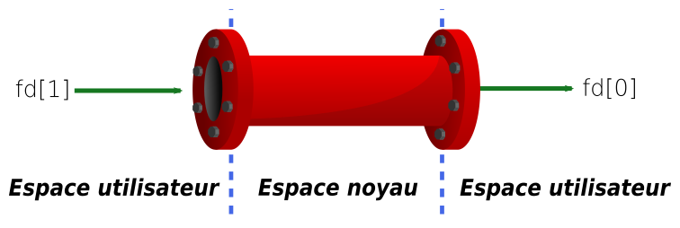

Les tubes sont un mécanisme de communication entre processus (**IPC** pour
*Inter Process Communication*). Sous *Unix*, les *IPC* peuvent prendre plusieurs
formes. Il facilitent la vie du développeur et sont un élément clé de la
réutilisation de composants.

Les tubes (ou *pipes* en anglais) que l'on trouve en C représentent la même
chose que les pipes en **shell** comme par exemple :

```shell
$ ps faux | less
```

Le but est toujours l'enchainement d'outils simples pour réaliser des tâches
plus ou moins complexe.

Les tubes sont un mécanisme de transfert de données sous forme de flux : les
données écrites d'un côté peuvent être lues de l'autre. Ils sont crées par le
noyau et manipulables par **des descripteurs de fichiers**.

Leurs création passe par un appel système :

```C
#include <unistd.h>

int pipe(int pipefd[2]);
```

`pipefd[2]` est un tableau de deux *fd* qui sera rempli par le noyau avant le
retour de l'appel : 

 - `pipefd[0]` est ouvert en lecture
 - `pipefd[1]` est ouvert en écriture

On peut faire le parallèle avec *STDIN* (0) et *STDOUT* (1).

En cas de succès, l'appel renvoie 0, sinon -1 et `errno` est positionné,



Le canal de communication créé est *half-duplex*, il ne va que dans un seul
sens. Il sont accessibles seulement par les processus qui y sont associés. Il
"vivent" le temps du processus et disparaissant à sa terminaison.

Ils sont portables et disponible **pour tous les Unix**. Certains proposent
d'ailleurs des modes full duplex, mais le code résultant est moins portables. Il
est tout de même possible de créer un mécanisme *full duplex* en créant deux
tubes.

## Exemple de communication half-duplex

### patron de conception

  1. créer le pipe : `pipe(fds)`
  2. créer un processus fils : `fork()`
  3. fermer un canal sur le processus père : `close(fds[0])`
  4. fermer un canal sur le processus fils : `close(fds[1])`
  5. écrire depuis ls père : `write(fds[1], "data")`
  6. lire depuis le fils : `read(fds[0], buffer)`


### Code

```C
#include <stdio.h>
#include <unistd.h>
#include <stdlib.h>
#define BUFMAX 256
int main () {
    char *buffer[BUFMAX];
    pid_t pid;
    int n, fds[2];
    if (pipe(fds) == -1) {
        perror("Unable to create pipe");
    }
    pid = fork();
    if (pid == -1) {
        perror("Unable to fork");
    }
    else if (pid > 0) { /* parent */
        if (close(fds[0]) == -1) {
            perror("Unable to close pipe from parent");
        }
        write(fds[1], "I am your father\n", 17);
    }
    else { /* child */
        if (close(fds[1]) == -1) {
            perror("Unable to close pipe from child");
        }
        n = read(fds[0], buffer, BUFMAX);
        write(STDOUT_FILENO, buffer, n);
    }
    exit(EXIT_SUCCESS);
}
```

## Communication full_duplex, patron de conception

 2. création du processus fils : `fork()`
 3. fermeture des canaux inutiles sur le père : `close(p2c[0]); close(c2p[1])`
 4. fermeture des canaux inutiles sur le fils : `close(p2c[1]); close(c2p[0])`
 5. lancer les communications : `write(); read();`

## Cas particuliers

 1. Il est préférable de fermer les extrémités inutiles d'un tube avant de
       l'utiliser
 2. Une lecture sur un tube déjà fermé retourne 0
 2. Une écriture sur un tube fermé retourne -1 et positionne `errno`. Le
    processus essayent d'écrire sur le pipe reçoit le signal `SIGPIPE`

## Les filtres Unix

Ce sont des programmes qui lise leurs données en entrées depuis *SDTIN* et les
écrivent depuis *STDERR*. Les filtres les plus utilisé sur les systèmes *Unix*
sont `sort`, `sed`, `cat`, `awk`, `less` etc.

### Exemple de filtres

Imaginons un programme pour lequel nous souhaitons avoir une pagination. Dans
l'idéal nous utiliserons la `$PAGER` du système au lieu d'en écrire un (`less`
par exemple)

#### Patron de conception
 1. Créer un tube avec `pipe(fds)`
 2. Créer un processus enfant avec `fork()`. Le processus père produira les
    données et le processus fils exécutera le programme de pagination.
 3. Le processus fils duplique la lecture du tube sur la sortie standard *STDIN*
 4. Il exécutera le programme de pagination qui lira les donnés depuis son
    entrée standard
 5. Le processus père écrira les données dans le pipe lues par le
    fils à l'autre extrémité.

#### Duplication de descripteur de fichiers

Il est possible de dupliquer les descripteur de fichiers avec les fonctions
`dup()` et `dup2()`.

```C
#include <unistd.h>

int dup(int old_fd);
int dup2(int old_fd, int new_fd);
```

`dup2()` transforme `new_fd` en une copie de `old_fd`, `newfd` peut être fermé
si besoin. Si `old_fd` n'est pas un descripteur de fichier valide l'appel échoue
et `new_fd` n'est pas fermé. Si `old_fd` est un descripteur de fichier valable
et est égal à `newfd` alors rien ne se passe et `dup2()` renvoie `new_fd`

#### Exemple en C

```C
#include <stdio.h>
#include <unistd.h>
#include <stdlib.h>
#include <sys/wait.h>

#define PAGER "less"

int main () {
    pid_t pid;
    int status, fds[2];
    FILE *fdout;
    if (pipe(fds) == -1) {
        perror("Unable to create pipe");
    }
    pid = fork();
    if (pid == -1) {
        perror("Unable to fork");
    }
    else if (pid > 0) { /* parent */
        if (close(fds[0]) == -1) {
            perror("Unable to close pipe from parent");
        }
        fdout = fdopen(fds[1], "w");
        if (fdout == NULL) {
            perror("Unable to open pipe as a stream for writing");
        }
        for(int i=1; i<=1000; i++) {
            fprintf(fdout, "%d\n", i);
        }
        fclose(fdout);
        wait(&status);
    }
    else { /* child */
        if (close(fds[1]) == -1) {
            perror("Unable to close pipe from child");
        }
        if (dup2(fds[0], STDIN_FILENO) != STDIN_FILENO) {
            perror("Unable to duplicate stdin file descriptor");
        }
        close(fds[0]);
        execlp(PAGER, PAGER, NULL);
    }
    exit(EXIT_SUCCESS);
}
```

## Bibliographie

[Présentation][f_pres] support de cours

[f_pres]:files/presentation.pdf
