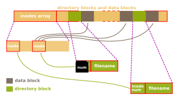

Les attributs de fichiers représentes toutes les informations dont dispose le
système sur les fichiers et répertoires : propriétaire, groupe permissions,
taille, horodatage etc.

## Système de fichiers

Un système de fichiers (ou système de gestion des fichiers) représente la façon
de stocker les fichiers, leurs informations et les organiser et sur un support
physique de stockage de masse. Parmi les plus courant on peut citer :

 - Ext4, système de fichier par défaut sur la plupart des installation
     GNU/Linux
 - NTFS, système de fichiers par défaut de Microsoft Windows
 - YAFFS pour Android
 - APFS pour les machines Apple (MacOS, iOS, et Apple TV)
 - ZFS pour les Unix
 
C'est bien entendu une liste non exhaustive, on pourrait citer des système plus
ancien comme FAT, UFS, HFS etc. Ou d'autres spécifique comme CEPH (système de
fichiers pour clusters).

## Anatomie d'un stockage de masse

Dans les premiers secteurs d'un disque dur, on trouve la table de partitions
cartographiant le disque. Il en existe deux type principaux : BPT et MBR Du type
de MBR découlera le nombres de partitions : 4 pour MD-DOS et pas de limites pour
le GPT par exemple.


### Gestion des fichiers dans le cas de la FAT

Le système de fichier FAT de Microsoft utilise le chainage de blocs : la table
d'allocation de fichiers contient l'adresse du premier bloc du fichiers. À la
fin de ce bloc, on obtient l'adresse du suivant. Avec ce système, la lecture
séquentielle est lente.

### Le cas le L'UFS

L'UFS pour *Unix File System* utilise, comme la plupart des systèmes de fichiers
moderne sous les systèmes Unix, utilise les i-nodes. Un numéro unique d'inode
est attribué à chaque fichier. Chaque fichier a un seul inode mais il peut avoir
plusieurs nom



Un inode peut aussi contenir d'autres informations comme le créateurs, les accès
etc.

## Appels Systèmes

La lecture des attributs de fichiers se fait par un appel système `stat()`.

```c
#include <sys/types.h>
#include <sys/stat.h>
#include <unistd.h>

int stat(const char *pathname, struct stat *statbuf);
```

Récupère les informations du fichiers pointé par `*pathname` et rempli la
structure `*statbuf`. En cas de succès renvoie 0 sinon -1 et positionne `errno`.

Il est aussi possible d'utiliser `fstat()`, variante de `stat()` mais utilisant
un descripteur de fichier.

```c
int fstat(int fd, struct stat *statbuf);
```

`lstat()` est utiliser dans le cas de lien symbolique, cet appel est utiliser
afin de récupérer les informations sur le lien lui-même et non le fichier
pointé.

```c
int lstat(const char *pathname, struct stat *statbuf);
```

### La structure stat

Voici les informations contenues dans la structure de type `stat`.

```c
struct stat {
    dev_t       st_dev;     /* Périphérique */
    ino_t       st_ino;     /* numéro d'inode */
    mode_t      st_mode;    /* protection */
    nlink_t     st_nlink;   /* nombres de lien physiques */
    uid_t       st_uid ;    /* UID du propriétaire */
    gui_t       st_gid;     /* UID du groupe */
    dev_t       st_rdev;    /* type de périphérique */
    off_t       st_size;    /* taille totale en octets */
    blksize_t   st_blksize; /* taille de bloc pou E/S */
    blkcnt_t    st_blocks;  /* nombres de blocks de 512o alloués */
    struct timespec st_atim; /* heure du dernier accès */
    struct timespec st_mtim; /* heure de la dernière modification */
    struct timespec st_ctim; /* heure du dernier changemet d'état */
}
```

`st_rdev`, `st_blksize`, et `st_blocks` ne sont pas requises par POSIX.1 mais
définies comme extensions dans SUS.

 - `st_mode` : Permissions d’accès au fichier ainsi que le type de ce dernier
     (répertoire, socket, fichier normal, etc.)
 - `st_ino` :Numéro de référence du fichier (SUSv4), identifiant unique
     d’accès au contenu du fichier, plus communément sous UNIX : numéro
     d’i-inœud
 - `st_dev` : Numéro du périphérique qui contient le système de fichier auquel
     se rapporte le numéro d’i-inœud
 - `st_nlink` : Nombre de liens physiques sur i-inœud (un fichier peut avoir
     plusieurs noms). L’appel système `unlink()` décrémente cette valeur 
     jusqu'à 0 alors le fichier sera réellement supprimé.
 - `st_size` : Taille du fichier mesurée en octets (uniquement utile pour les
     fichiers normaux)

### tests sur les types de fichiers

Ces extraits de codes permettent de tester les types de fichiers. `statbuf`
étant le retour de `stat()` ou de ses dérivées.

```c
if (S_ISREG(statbuf.st_mode)) {
    printf "Regular file";
}
if (S_ISDIR(statbuf.st_mode)) {
    printf "Directory file";
}
if (S_ISCHR(statbuf.st_mode)) {
    printf "Character special file";
}
if (S_ISBLK(statbuf.st_mode)) {
    printf "Block special file";
}
if (S_ISFIFO(statbuf.st_mode)) {
    printf "Pipe or Fifo";
}
if (S_ISLNK(statbuf.st_mode)) {
    printf "Symbolic link";
}
    if (S_ISSOCK(statbuf.st_mode)) {
    printf "Socket";
}
```

#### Exemple de code 

```c
#include <stdio.h>
#include <stdlib.h>
#include <sys/types.h>
#include <sys/stat.h>
#include <unistd.h>
int main(int argc, char *argv[]) {
    int i;
    struct stat statbuf;
    for (i = 1; i < argc; i++) {
        printf("%s: ", argv[i]);
        if (lstat(argv[i], &statbuf) < 0) {
            perror("Unable to get stats");
            continue;
         }
        if (S_ISREG(statbuf.st_mode)) {
            printf("regular\n");
        }
        else if (S_ISDIR(statbuf.st_mode)) {
            printf("directory\n");
        }
        else if (S_ISCHR(statbuf.st_mode)) {
            printf("character special\n");
        }
        else if (S_ISBLK(statbuf.st_mode)) {
            printf("block special\n");
        }
        else if (S_ISFIFO(statbuf.st_mode)) {
            printf("fifo\n");
        }
        else if (S_ISLNK(statbuf.st_mode)) {
            printf("symbolic link\n");
        }
        else if (S_ISSOCK(statbuf.st_mode)) {
            printf("socket\n");
        }
        else {
            printf("*unknown*\n");
        }
    }
    exit(EXIT_SUCCESS);
}
```

##### Exécution

```shell
$ ./stat-file /etc /etc/passwd /dev/null /dev/sda
/etc: directory
/etc/passwd: regular
/dev/null: character special
/dev/sda: block special
```

### Tests sur les permissions de fichiers

Les extraits de codes suivant permettent des tester les permissisons sur les
fichiers et répertoires. 

```c
if (statbuf.st_mode & S_IRUSR) { printf "User can read"; }
if (statbuf.st_mode & S_IWUSR) { printf "User can write"; }
if (statbuf.st_mode & S_IXUSR) { printf "User can execute"; }
if (statbuf.st_mode & S_IRGRP) { printf "Group can read"; }
if (statbuf.st_mode & S_IWGRP) { printf "Group can write"; }
if (statbuf.st_mode & S_IXGRP) { printf "Group can execute"; }
if (statbuf.st_mode & S_IROTH) { printf "Others can read"; }
if (statbuf.st_mode & S_IWOTH) { printf "Others can write"; }
if (statbuf.st_mode & S_IXOTH) { printf "Others can execute";}
```

### changer les permissions sur un fichier

```c
#include <sys/stat.h>
int chmod(const char *pathname, mode_t mode);
```

Modifie les permissions du fichier référencé par `*pathname`

```c
in fchmod(int fd, mode_t mode);
```

Modifie les permissions tout comme `chmod()` mais prend un descripteur de
fichier en paramètre.

Dans les deux cas, `mode` est un masquage de bits avec les paramètres suivants :

| mode    | octal | utilisation                                           |
|---------|-------|--------------------------------------------------------
| S_IRWXU | 00700 | Le propriétaire a le droit de lire, écrire, exécuter  |
| S_IRUSR | 00400 | L’utilisateur a le droit de lire                      |
| S IWUSR | 00200 | L'utilisateur a le droit d'écrire                     |
| S IXUSR | 00100 | L'utilisateur a le droit d'exécuter                   |
| S_IRWXG | 00070 | Le groupe a le droit de lire, écrire, exécuter        |
| S_IRGRP | 00040 | Le groupe a le droit de lire                          |
| S IWGRP | 00020 | Le groupe a le droit d'écrire                         |
| S IXGRP | 00010 | Le groupe a le droit d'exécuter                       |
| S_IRWXO | 00007 | Le propriétaire a le droit de lire, écrire, exécuter  |
| S_IROTH | 00004 | Les autres ont le droit de lire                       |
| S IWOTH | 00002 | Les autres onr le droit d'écrire                      |
| S IXOTH | 00001 | Les autres ont le droit d'exécuter                    |
|         |       | S_ISUID, S_ISGID, S_ISVTX, cf. man 2 chmod 

En cas de succès, retourne 0, sinon -1 et positionne `errno`

### Modifier l'appartenance d'un fichier

```c
#include <unistd.h>
int chown(const char *path, uid_t owner, gid_t group);
```

Modifie l'appartenance d'un fichier pointé par `*path`. comme pour `stat()`, il
existe un variante avec un descripteur de fichiers : `fchown()` et une pour les
lien symboliques `lchmod()`.

En cas de succès, retourne 0, sinon -1 et positionne `errno`
