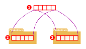

Les communications inter processus, ou *IPC* (pour Inter Process Communication)
comprennent un ensemble de mécanismes permettant à des processus concurrents de
Communiquer.

Il existe trois mécanisme :

 - les **files de messages** (message queue)
 - **la mémoire partagée**
 - **les sémaphores**

Et deux API différentes

 - **System V IPC** datant de 1983. C'est l'API historique, plus compliquer à
     utiliser, elle ne se base pas sur les descripteurs de fichiers.
 - **IPC POSIX** datant de 2004 et également normée dans *SUSv4*. C'est une API
     moderne et disponible dans le noyau Linux à partis de la version 2.6.10

## Les files de messages

C'est un mécanisme utilisé pour envoyer / recevoir des données entre processus
suivant un mécanisme d'expéditeur / destinataire. Les communication sont
asynchrones : l'expéditeur n'est pas contraint d'attendre la réception du
message par le destinataire pour continuer son exécution.

Les informations envoyées à une file de message ne sont pas destinée à un
processus en particulier.

C'est un mécanisme proche des tubes, seulement les données ne sont pas lues
comme un flux d'octets.

## Exemple de code

### Ouvrir une file de message

```c
mqd_t mq_open(const char *name, int flags);
mqd_t mq_open(const char *name, int flags, mode_t mode, struct mq_attr *attr);
```

En cas d'échec, retourne -1 avec `errno` positionné, sinon un descripteur de
file de message

 - `name` : nom de la file de message, il doit commencé par le caractère `/` et
     ne pas en contenir d'autres.
 - `flag` et `mode` : ce sont exactement les mêmes choses que pour `open()`
 - `attr` : attributs de la file de messages comme le nombre maximal de messages
     à stocker, la taille maximale d'un message ...

### Envoyer un message

```c
int mq_send(mqd_t mqdes, const char *buffer, size_t len, unsigned int prio);
int mq_timedsend(mqd_t mqdes, const char *buffer,
                              size_t len, unsigned int prio,
                              const struct timespec *abs_timeout);
```

Renvoie 0 en cas de succès, sinon -1 et `errno` est positionné. Si la file de
messages et pleine, ces deux appels sont bloquant jusqu'à libération d'une
place.`mq_timedsend()` échouera si le message n'as pu être mis dans la file
après le temps donné par `*abs_timeout`

Les messages seront dépilés dans l'ordre décroissant de priorité (0 en dernier)

### Lire un message

```c
ssize_t mq_receive(mqd_t mqdes, char *buffer, size_t len, unsigned int *prio);
ssize_t mq_timedreceive(mqd_t mqdes, char *buffer,
                                     size_t len, unsigned int *prio,
                                     const struct timespec *abs_timeout);
```

Renvoie le nombre d'octets du message reçu ou 0 (et `errno` positionné) en cas
d'échec.

Le `buffer` doit être assez grand pour contenir le plus grand message que la
file pourrait envoyé. La dimension des messages peut être obtenu avec
`mq_getattr()` et modifiée avec `mq_setattr()`.

Tout comme la version temporisée de `mq_send()`, `mqtimedreceive()` échouera si
le message n'est pas lu avant un temps donné par `*abs_timeout`.

### Fermeture / suppression d'une liste

```c
// fermeture d'une file
int mq_close(mqd_t mqdes);

// suppression d'une liste
int mq_unlink(mqd_t mqdes);
```

Ces deux fonctions retourne 0 en cas de succès, -1 et positionne `errno` en cas
d'échec.

Une file est persistante et reste disponible pour les autres processus après
fermeture.

Tout comme `unlink()` pour les fichiers, la suppression d'une file de message
sera effective seulement lorsque plus aucun processus ne l'utilisera.

### Envoi d'un message, exemple complet

```c 
#include <fcntl.h>
#include <mqueue.h>
#include <stdio.h>
#include <stdlib.h>
#include <string.h> 
int main (int argc, char **argv) {
    mqd_t mq;
    int priority;
    if (argc != 4) { 
        fprintf(stderr, "Usage: %s queue priority message\n", argv[0]);
        exit(EXIT_FAILURE); 
    }
    if (sscanf(argv[2], "%d", &priority) != 1) {
        fprintf(stderr, "Invalid priority: %s\n", argv[2]); 
        exit(EXIT_FAILURE);
    }
    if ((mq = mq_open(argv[1], O_WRONLY | O_CREAT, 0644, NULL)) == (mqd_t) -1) {
        perror("Opening message queue failed"); 
        exit(EXIT_FAILURE); 
    }
    if (mq_send(mq, argv[3], strlen(argv[3]), priority) == -1) {
        perror("Unable to send message to queue");
        exit(EXIT_FAILURE);
    }
    if (mq_close(mq) == -1) {
        perror("Unable to close queue");
        exit(EXIT_FAILURE);
    }
    return EXIT_SUCCESS;
}
```

### exemple de lecture

```c
#include <fcntl.h>
#include <mqueue.h>
#include <stdio.h>
#include <stdlib.h>
#include <string.h> 
int main (int argc, char * argv[]) {
    int n;
    mqd_t mq;
    struct mq_attr attr;
    char * buffer = NULL;
    unsigned int priority;
    if (argc != 2) {
        fprintf(stderr, "Usage: %s queue\n", argv[0]);
        exit(EXIT_FAILURE);
    }
    if ((mq = mq_open(argv[1], O_RDONLY)) == (mqd_t) -1) {
        perror("Opening message queue failed");
        exit(EXIT_FAILURE);
    }
    if (mq_getattr(mq, &attr) != 0) {
        perror("Unable to get message queue attributes");
        exit(EXIT_FAILURE);
    }
    if ((buffer = (char *) malloc(attr.mq_msgsize)) == NULL) {
        perror("Unable to allocate memory");
        exit(EXIT_FAILURE);
    }
    if ((n = mq_receive(mq, buffer, attr.mq_msgsize, &priority)) < 0) {
        perror("Unable to receive message from queue");
        exit(EXIT_FAILURE);
    }
    if (mq_close(mq) == -1) {
        perror("Unable to close queue");
        exit(EXIT_FAILURE);
    }
    fprintf(stdout, "[%d] %s\n", priority, buffer);
    free(buffer);
    return EXIT_SUCCESS;
}
```

### Compilation et exécution

Afin de compiler un programme C faisant appel à des files de messages, il est
important de rajouter le paramètre `-lrt`.

```shell
$ gcc -Wall -lrt mq-send.c -o mq-send
$ ./mq-send /plop 10 "Msg 10" 
$ ./mq-send /plop 20 "Msg 20" 
$ ./mq-send /plop 80 "Msg 30"
$ gcc -Wall -lrt mq-recv.c -m mq-revc
$ ./mq-recv /plop
[30] Msg 30
$ ./mq-recv /plop
[20] Msg 20
$ ./mq-recv /plop
[10] Msg 10
```

## Mémoire partagée

Une zone de mémoire vive est accédée par plusieurs processus afin de partager
des données. Celà  consiste à ouvrir un segment de mémoire avec `shm_open()` (1)
puis de le projeter dans l'espace mémoire d'un processus avec `mmap()` (2)

Les zones de mémoire partagées sont stockées dans le répertoire `/dev/shm/`

La mémoire partagée est plus rapide que les files de messages, elle est aussi
moins limitée (les files de messages nécessite deux appels systèmes distinct)



### Projection de mémoire

```c
#include <sys/mman.h>
void *mmap(void *addr, size_t length,
                       int protect, int flags, int fd, off_t offset);
```

`mmap()` crée une projection de la mémoire partagés dans l'espace d'adressage
virtuel du processus appelant. L'adresse de démarrage de la nouvelle projection
est indiqué par `*addr`, `length` indiquant la taille de la zone mémoire
projetée.

L'appel renvoi un pointeur sur la zone de mémoire et `MAP_FAILED` et positionne
`errno` en cas d'échec.

 - `protect` : défini le type d'accès autorisé : `PROT_EXEC`, `PROT_WRITE`,
     `PROT_READ` ou `PROT_NONE`
 - `flag` : Défini le type de partage par exemple `MAP_PRIVATE` (toute
     modification dans cet espace ne sera pas visible par les autres
     processus projetant la zone) ou `MAP_SHARED` (modifications visibles par
     tous les autres processus).
 - `fd` : descripteur de fichier.
 - `offset` : décalage dans le fichier pointé par `fd`.

### Exemple d'accès à un segment de mémoire partagée.

```c
#include <fcntl.h>
#include <stdio.h>
#include <stdlib.h>
#include <string.h>
#include <unistd.h>
#include <sys/mman.h>

int main (int argc, char **argv) {
    int fd;
    long int *counter;
    if (argc != 2) {
        fprintf(stderr, "Usage: %s segment\n", argv[0]);
        exit(EXIT_FAILURE);
    }
    if ((fd = shm_open(argv[1], O_RDWR | O_CREAT, 0600)) == -1) {
        perror("Opening shared memory segment failed");
        exit(EXIT_FAILURE);
    }
    if (ftruncate(fd, sizeof(long int)) != 0) {
        perror("Unable to truncate shared memory segment");
        exit(EXIT_FAILURE);
    }
    counter = mmap(NULL, sizeof(long int), PROT_READ | PROT_WRITE, MAP_SHARED,fd, 0);
    if (counter == MAP_FAILED) {
        perror("Unable to map shared memory segment")
        exit(EXIT_FAILURE);
    }
    for(long int i=0; i< 1000000000; 1++) {
        (*counter)++;
    }
    fprintf(stdout, "counter=%ld\n",
    return EXIT_SUCCESS;
}
```

#### Compilation et exécution

```shell
$ gcc -Wall -lrt shm-inc.c -o shm-inc
$ ./shm-inc /foobar
counter=1000000000
$ ./shm-inc /foobar
counter=2000000000
$ ls -l /dev/shm
-rw------- 1 user group 8 Nov 15 00:00 foobar
$ cat /dev/shm/foobar
5w
$ hexdump /dev/shm/foobar
0000000 9400 7735 0000 0000
0000008
$ echo "7*16^7 + 7*16^6 + 3*16^5 + 5*16^4 + 9*16^3 + 4*16^2 + 0*16^1 + 0*16^0" | bc
2000000000
```

Nous pouvons vérifié que la valeur donné par `counter` correspond bien à ce qui
se trouve dans notre segment de mémoire partagée contenu dans `/dev/shm/foobar`.

#### Problème d'accès à une section critique

Exécutons maintenant notre processus deux fois en même temps, une fois en avant
plan et une fois en arrière plan (en prenant soin de supprimer notre segment
partagé avant)

```c
$ rm -f /dev/shm/foobar
$ ./shm-inc /foobar & ./shm-inc /foobar
counter=1004416125
```

On voit bien que la valeur retournée n'est pas celle attendu, tout comme les
problèmes de variables partagées dans les processus légers.

## Les sémaphores

Il permettent de synchroniser les processus entre eux et un accès concurrent
aux ressources partagées. Il se présente sous la forme d'un entier strictement
positif. Seule deux opérations sont possibles sur les sémaphore :

 - **l'incrémentation** de sa valeur `V()` (du néerlandais Verghotenm -
     incrémenter, référence à l'inventeur des sémaphores E. Djikstra)
 - **la décrémentation** de sa valeur `P()` (proberen - tester). Si le sémaphore
     est égal à 0, celui-ci est bloquant jusqu'à ce que sa valeur devienne
     supérieure à 0.

Dans la norme POSIX, les sémaphores peuvent être de deux types : **nommés** ou
**anonymes**

### Sémaphore anonyme

Comme son nom l'indique, un sémaphore anonyme n'as pas de nom. Il est aussi
appelés sémaphore en mémoire. Il peut etre partagé entre plusieurs thread d'un
même processus via des variables globales. Mais aussi par plusieurs processus
via un espace de mémoire partagée (via l'utilisation de segment de mémoire
partagée via `shm_open()`

#### Création destruction

```c
#include <semaphore.h>
int sem_init(sem_t *sem, int pshared, unsigned int shared);
```

Renvoie 0 en cas de succès, sinon -1 et positionne `errno`

 - `pshared` indique si le sémaphore sera partagé entre des *threads* (0) et
     dans se cas sera situé dans une variable visible par tous ceux du processus
     (variable globale ou allouée sur le tas) ou entre *processus* ( NON NULL)
     et donc situé dans une zone de mémoire partagée.
 - `value` spécifie la valeur initiale du processus.

```c
#include <semaphore.h>
int sem_destroy(sem_t *sem);
```

Renvoie 0 en cas du succès, sinon -1 et `errno` est positionné.

### Sémaphore nommé

Il est identifié par un nom commençant par le caractère `/` suivi d'un ou
plusieurs caractères. Deux (ou plus) processus utilisent le même sémaphore nommé
en passant le même nom à `sem_open()`


```c
include <fcntl.h>
#include <sys/stat.h>
#include <semaphore.h>

sem_t *sem_open(const char *name, int flags);
sem_t *sem_open(const char *name, int flags, mode_t mode, unsigned int value);
```

Renvoie l'adresse su nouveau sémaphore en cas de succès, sinon `SEM_FAILED` et
positionne `errno`.

 - `name` défini le nom du sémaphore
 - `mode` et `flags` correspondent aux mêmes paramètre que l'appel système
     `open()`
 - `value` défini la valeur initiale du sémaphore.

```c
#include <semaphore.h>
int sem_close(sem_t *sem);
```

Renvoie 0 en cas de succès, sinon -1 et positionne `errno`.

### Opération sur les sémaphores

Les opération suivantes sont valables sur les deux types de sémaphores.

#### Décrémenter le sémaphore

```c
#include <semaphore.h>
int sem_wait(sem_t *sem);
```

Retourne 0 en vas de succès, sinon -1 avec `errno` positionné. Comme indiqué
plus haut, si le sémaphore est égal à 0, cet appel est bloquant en attendant
son incrémentation.

#### Incrémenter le sémaphore

```c
#include <semaphore.h>
int sem_post(sem_t *sem);
```

Retourne 0 en cas de succès, sinon -1 et positionne `errno`.

### Sémaphore et mutex, quelle différences?

Les mutex sont utilisé pour sérialiser l'accès à une section de code devant être
exécutées par plusieurs threads. Un mutex autorisera alors un seul thread à
accéder à la ressource, forçant les autres threads à attendre la libération de
celle-ci.

Les sémaphores restreignent le nombre d'utilisation maximale d'une ressource
partagée. Les threads demandent alors l'accès à la ressource, décrémentant ainsi
le sémaphore puis signalent lorsqu'ils on finit, incrémentant ainsi le
sémaphore.

### Exemple de code utilisant les sémaphores

```c
#include <errno.h>
#include <fcntl.h>
#include <semaphore.h>
#include <stdio.h>
#include <stdlib.h>
#include <unistd.h>

int main(int argc, char **argv) {
    int i;
    sem_t *sem;
    if (argc != 2) {
        fprintf(stderr, "Usage: %s sem_name\n", argv[0]);
        exit(EXIT_FAILURE);
    }
    sem = sem_open(argv[1], O_RDWR | O_CREAT, 0666, 1);
    if (sem == SEM_FAILED) {
        perror("Unable to open semaphore");
        exit(EXIT_FAILURE);
    }
    fprintf(stdout, "[%d] Sempahore %s created\n", getpid(), argv[1]);
    for (i = 0; i < 3; i ++) {
        fprintf(stdout, "[%d] waiting...\n", getpid());
        sem_wait(sem);
        fprintf(stdout, "\t[%d] semaphore locked\n", getpid());
        sleep(4);
        fprintf(stdout, "\t[%d] semaphore released\n", getpid());
        sem_post(sem);
        sleep(2);
    }
    return EXIT_SUCCESS;
}
```

#### Compilation et exécution

Comme pour les files de message ou la mémoire partagée, il faut utiliser
l'argument `-lrt` du compilateur gcc. Il est aussi nécessaire d'utiliser
`-pthread`.

```shell
$ gcc -pthread -lrt -Wall sem-lock.c -o sem-lock
$ ./sem-lock foobar & ./sem-lock foobar ./sem-lock foobar
$ ls -l /dev/shm
-rw-r--r-- 1 user group 32 Nov 15 00:00 sem.foobar
```

Comme pour la mémoire partagée, le sémaphore est créé dans le répertoire
`/dev/shm/`,  mais son nom commence par `sem.`. Dans l'exemple, le nom ne
commence pas par un `/`, ce qui ne semble pas posé de problèmes à l'exécution
(est-ce une bonne pratique plutôt qu'un impératif?)

#### Sortie de l'exécution

```shell
[16597] Sempahore foobar created
[16597] waiting...
[16597] semaphore locked
[16599] Sempahore foobar created
[16599] waiting...
[16600] Sempahore foobar created
[16600] waiting...
[16597] semaphore released
[16599] semaphore locked
[16597] waiting...
[16599] semaphore released
[16600] semaphore locked
[16599] waiting...
[16600] semaphore released
[16597] semaphore locked
[16600] waiting...
[16597] semaphore released
[16599] semaphore locked
[16597] waiting...
[16599] semaphore released
[16600] semaphore locked
[16599] waiting...
[16600] semaphore released
[16597] semaphore locked
[16600] waiting...
[16597] semaphore released
[16599] semaphore locked
[16599] semaphore released
[16600] semaphore locked
[16600] semaphore released
```

## Bibliophraphie

 - [Page Wikipedia][l_w_mq] sur les file de messages
 - [Page Wikipedia][l_w_shm] sur la mémoire partagée.
 - [Les sémaphores][l_sem_ulouvain] Cours sur l'Université Catholique de Louvain
     (Belgique) par O. Bonaventure, G. Detal, C. Paasch.
 - [Page Wikipedia][l_w_sem] sur les sémaphores.
 - [Page de manuel][l_u_sem] sur le site d'Ubuntu (et en français) sur
     l'implémentation en C des sémaphores.

[l_w_mq]:https://fr.wikipedia.org/wiki/File_d%27attente_de_message
[l_sem_ulouvain]:https://sites.uclouvain.be/SystInfo/notes/Theorie/html/Threads/coordination.html
[l_w_shm]:https://fr.wikipedia.org/wiki/M%C3%A9moire_partag%C3%A9e_(communication_inter-processus)
[l_w_sem]:https://fr.wikipedia.org/wiki/S%C3%A9maphore_(informatique)
[l_u_sem]:http://manpages.ubuntu.com/manpages/precise/fr/man7/sem_overview.7.html

