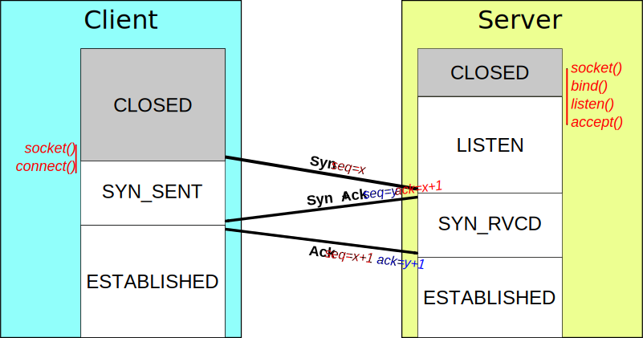
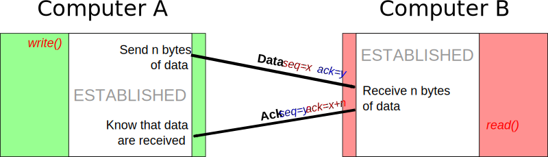
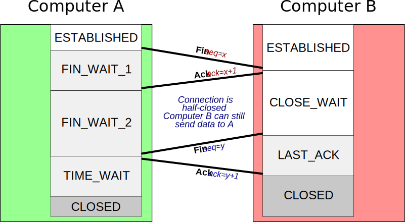
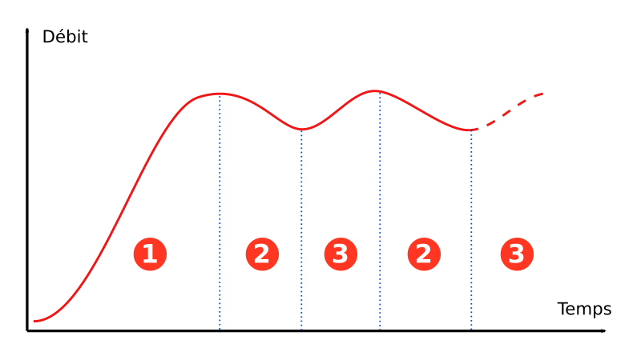

Les protocoles sont des conventions qui définissent des manières de communiquer.
En informatique on dénombre deux types de protocoles : binaires ou textuels.

Théoriquement, aucun protocole ne peut être parfait. Ceci peur être illustré par
,le  théorème des deux armées :

> Soit deux armées qui combattent, l'armée A, composée d'un seul soldat est
> assiégés par l'armée B composée elle de deux soldats.
>
> Les deux soldats B sont de part et d'autres du soldat de A qui possède un
> fusil. Pour assurer leurs victoire, les deux soldats B doivent attaquer de
> façon coordonnée. Utilisant des pigeons voyageurs, comment s'assurer de la
> bonne transmission des messages : le soldat A pourrait tuer le messager à tout
> moment (contenant le message ou la confirmation de bonne réception).

# La commutation de circuits

C'est le fonctionnement typique du réseau téléphonique jusque dans les années
60-70. les information échangées emprunte toujours le même chemin au sein du
réseau pour une session donnée. Son principal inconvénient est l'occupation de
la "route" même si aucune donnée ne transite (blanc).

Voir [la commutation de circuits][w_comm-cirk] sur Wikipedia

[w_comm-circ]:https://fr.wikipedia.org/wiki/Commutation_de_circuits

# La commutation de paquet

Apparue dans les années 70, il est ici question de découper l'information en
paquets contenant un entête pour l'acheminement, et de les faire transiter par
des routes aui peuvent être différentes. Il n'y a pas ici de réservation de
route, optimisant l'utilisation de la ressource.

En France, l'ingénieur [Louis Pouzin][w_l-pouzin] a inventé le datagramme qui
servira de base pour le réseau par commutation de paquets, puis pour le
protocole UDP et inspirera Vint Cerf pour la création de TCP-IP

Voir [la commutation de paquets][w_comm-pak] sur Wikipedia

[w_l-pouzin]:https://fr.wikipedia.org/wiki/Louis_Pouzin
[w_comm-pak]:https://fr.wikipedia.org/wiki/Commutation_de_paquets

# Les sommes de contrôles

Les *checksum* ou sommes de contrôles permettent de s'assurer de l'intégrité
d'un message reçu par le réseau. Ce n'est cependant pas un code de correction
d'erreur, le but ici est bien la détection (pour éventuellement demander à
l'expéditeur de renvoyer le message).

Dans notre quotidien, les sommes de contrôles sont utilisée pour les numéros
INSEE, les numéros de cartes bancaire etc.

Il sont là avant tout pour détecter des erreur non intentionnelle (fiabilité) 
mais n'ont pas vocation à prévenir les erreur intentionnelles (sécurité)

Voir [les sommes de contrôles][w_checksum]

[w_checksum]:https://fr.wikipedia.org/wiki/Somme_de_contr%C3%B4le

# Le protocole TCP

TCP pour *Transmission Control Protocol* est un protocole de transport fiable de
l'information sur des réseau informatique. Il correspond à la couche
**transport** du modèle OSI. Il fonctionne en trois phases :

 - L'établissement d'une connection
 - Le transfert des données
 - La fin de connexion

## Etablissement d'une connexion

Le serveur ouvre une *socket* et attends la demande de connexion du client
(attente passive). Le client initie une connexion active en trois temps : 

 - le client envoi un segment *SYN* au serveur.
 - le serveur lui réponds par un segment *ACK + SYN*
 - le client confirme par un segment *ACK*

Durant ces échanges, les numéros de séquences du serveur et du client sont
synchronisés. Le client utilise son numéro de séquence `x` pour son premier
segment *SYN*. Le serveur utilise son numéro de séquence `y` dans le segment
*ACK+SYN* et le numéro d'acquittement `x + 1`. Le client confirme par un *ACK* 
avec comme numéro de séquence `x + 1` et comme numéro d'acquittement `y + 1`.

## Tranfert de données

Lors du transfert de données, les numéros de séquences  sont utilisés afn de
réordonner les paquets. Les acquittements servent à s'assurer de la transmission
des messages et les sommes de contrôles leurs intégrités.

 - Le serveur envoi un paquet avec comme numéro de séquence `x` et est numero
     d'acquittement `y` avec `z` octets
 - le client réponds avec un segment *ACK* avec comme numéro de séquence `x`
     et comme numéro d'acquittement `y + z`

Les numéros de séquences sont des nombres entiers non signés codés sur 32bits

### temporisation

TCP utilise un mécanisme de temporisation et de retransmission. Après l'envoi
d'un segment, TCP attendra un certain temps la confirmation par un *ACK*
correspondant.

## Terminaison d'une connexion

La fin d'une connexion TCP se fait en quatre temps, chaque extrémité de la
connexion envoyant un segment *FIN* et répondant à l'autre par un *ACK*

## Gestion des flux

Dans un espace réseau, comment les extrémités (souvent le serveur) devinent la
vitesse de transmission des segments? En général prudemment : le serveur
commence à transférer les données lentement et augmente au fur et à mesure le
débit. Il inspecte alors les *ACK* et ajuste le débit en fonction des retours.

 1. la connexion démarre doucement, le débit augmente au fur et à mesure que les
    *ACK* reviennent en temps et en heure.
 2. les segments *ACK* n'arrivent pas à temps, le débit est diminué.
 3. à partir du moment ou les segments *ACK* arrivent bien, le débit est
    augmenté à nouveau progressivement.
 4. on repasse à l'étape 2.

 Il existe plusieurs algorithmes pour la gestion du débit : Reno, Vegas, Bil,
 Cubil.

# Bibliographie

[TCP sur Wikipedia](https://fr.wikipedia.org/wiki/Transmission_Control_Protocol)
