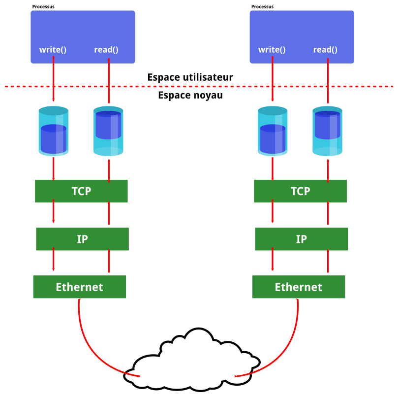

# API C pour un paquet UDP (exemple du DNS)

 1. `socket()` : Appel système qui retourne un identifiant unique (entier non
    signé) représentant une socket ouverte par le noyau, dans le style d'un
    descripteur de fichier.
 2. `bind(53)` : Le processus annonce qu'il se positionne sur le port 53 en
    écoute (serveur DNS)
 3. `rcvfrom()` : récupère les données (datagrammes) depuis le noyau, c'est un
    appel bloquant.
 4. `sento()` : le processus fournit au noyau les données pour le transfert (
    l'écriture). C'est l'équivalent de `write()` utilisé poour les fichiers.
 5. `close()` : ferme la connexion.

Ces étapes décrites ci-dessus sont valables pour la partie serveur, la partie
client est plus simple : `socket()` -> `sendto()` -> `rcvfrom()` -> `close()`

# API pour un transfert TCP (avec connexion)

# côté serveur

 1. `socket()`
 2. `bind(80)`
 3. `listen()` : annonce l'ouverture du port et l'écoute
 4. `accept()` : attend des connexion avec un client (état disponible)
 5. `read()` : appel système lit les données provenant du réseau, en HTTP ce
    serait la demande de la page `index.html` par exemple.
 6. `write()` : renvoi les données vers le réseau qui seront ensuite envoyées
    par le noyau vers le client.

## côté client

 1. `connect()` : appel cloquant pour initier la connexion.
 2. `write()` : envoyer les donnés vers le client (la requete HTML par exemple)
 3. `read()` : lit les données (bloquant). Dès que les données sont prête, elles
    sont envoyées à l'application. Si rien n'est lut, l'appel se terminera alors
    seulement au moment du `close()`

# Socket

Pour démarrer une socket, plusieurs information son importante et changerons la
manière de procéder :

 - la famille d'adresse : IPv4, IPv6
 - le type de socket : échange simple de datagrammes (UDP) ou par une
     connexion (TCP)
 - le protocole : TCP, UDP, ICMP ...
 - l'adresse locale (IP et port)
 - l'adresse distante (IP et port)

# API C

Il faut bien avoir à l'esprit qu'en réseau, les données sont toujours au forman
big-endian. Pour avoir plus d'explications voir la page Wikipedia sur
[l'endianess](https://fr.wikipedia.org/wiki/Endianness).

Il faut donc penser à utiliser des fonctions de conversion :

```c
/* Conversion vers/depuis ordre réseau */
uint16_t htons(uint16_t hostshort); #host to network short
uint16_t ntohs(uint16_t netshort);  #network to host short
uint32_t htonl(uint32_t hostlong);  #host to network long
uint32_t ntohl(uint32_t netlong);   #network to host long

/* Conversion ascii/binaire */
int inet_aton(const char *ascii, struct in_addr *binaire);
char *inet_ntoa(struct in_addr binaire);

/* De même, mais portables v4/v6 */
int inet_pton(sa_family_t af, const char *ascii, void *binaire);
const char *inet_ntop(sa_family_t af, const void *binaire, char *ascii, socklen_t size);
```

## Structure pour IPv4

```c
struct in_addr {
    /* ... */
    __be32 s_addr;
}
struct sockaddr_in {
    sa_family_t     sin_family; /* AF_INET6 */
    struct in6_addr sin_addr;
    __be16          sin_port;
}
```

## Structure pour ipv6

```c
struct in6_addr {
    /* ... */
    u8 s6_addr[16];
}
struct sockaddr_in {
    sa_family_t     sin6_family; /* AF_INET6 */
    struct in6_addr sin6_addr;
    __be16          sin6_port;
}
```

## API UDP

```c
/* Créer une socket */
int socket(int domain, int type, int protocol);
/* e.g. fd = socket(AF_INET, SOCK_DGRAM, 0); */

int bind(
    int sockfd,                 # numéro de descripeur de socket
    const struck sockaddr *addr # sock_addr peut être de type 4 ou 6 (cast)
    socklen_t addrlen           # taille de a structure sock_addr
)
/* Choisir l’adresse distante (IP et port), optionnel, pour utiliser
send/write/recv/read plutôt que sendto/recvfrom */

int connect(int sockfd, const struct sockaddr *addr, socklen_t addrlen);

/* Envoyer un datagramme UDP à un service d’une machine donnée */
ssize_t sendto(
    int sockfd,
    const void *buf,
    size_t len,
    int flags,
    const struct sockaddr *dest_addr,
    socklen_t addrlen
);

/* Recevoir un datagramme UDP depuis n’importe quelle machine */
ssize_t recvfrom(
    int sockfd,
    void *buf,                  #tampon de données (ici à recevoir)
    size_t len,
    int flags,
    struct sockaddr *src_addr,
    socklen_t *addrlen
);

/* Fermer la socket */
int close(int fd);
```

## API C TCP

```c
* voir man 7 tcp pour plus d’explications */
/* Créer une socket */
int socket(int domain, int type, int protocol);
/* e.g. fd = socket(AF_INET, SOCK_STREAM, 0); */

/*** Partie client ***/
/* Se connecter à un service d’une machine donnée */
int connect(int sockfd, const struct sockaddr *addr, socklen_t addrlen);

/*** Partie serveur ***/
/* Attacher à un port local donné */
int bind(int sockfd, const struct sockaddr *addr, socklen_t addrlen);

/* Passer en mode serveur */
int listen(int sockfd, int backlog);

/* Accepter une nouvelle connexion */
int accept(int sockfd, struct sockaddr *addr, socklen_t *addrlen);

/* Fermer la socket */
int close(int fd);

/* Récupérer l’adresse locale */
int getsockname(int sockfd, struct sockaddr *addr, socklen_t *addrlen);

/* Récupérer l’adresse distante */
int getpeername(int sockfd, struct sockaddr *addr, socklen_t *addrlen);
```

# `write()`, `read()`, Tampons noyau



Pour chacune des connexions établies le noyau Linux créer des tampons : un pour
la lecture et un pour l'écriture. Pour la l'écriture, lorsqu'un processus
invoque un `write()`, les données sont d'abord écrites dans un tampon. S'il est
plein (sa taille est définie à l'avance), le noyau bloque l'appel `write()` et
lorsque de la place se libère, il le débloque.

De l'autre côté, les données sont reçues dans le tampon `read()` et lorsqu'elles
sont transférées au processus, un segment *ACK* est envoyé à l'expéditeur. le
destinataire averti l'expéditeur de la place disponible dans son tampon `read()`
par le biais du champ `window size` (octet 16 à 18 d'un sergent TCP) dans un
segment *ACK*. Si le tampon contient, par exemple 2ko mais que le `read()` en
demande 10ko, les 2Ko sont automatiquement transférés au processus.

Les tampons peuvent fausser complètement les outils de mesure de performance
réseau, en effet lors d'un appel `write()` les données sont transmise dans le
tampon très rapidement faussant alors la mesure du débit.

## visualiser les buffers.

Il est possible de visualiser les données en attentes dans les buffets avec la
commande `netstat` : 

```shell
[root@eph-archbook ephase]# netstat
Active Internet connections (w/o servers)
Proto Recv-Q Send-Q Local Address           Foreign Address         State
tcp        0      0 eph-archbook:47954      mail.gandi.net:imaps    ESTABLISHED
tcp        0      0 eph-archbook:52264      imap.u-bordeaux.fr:imap ESTABLISHED
tcp       32      0 ?192.168.1.91:34456      vpn-0-24.aquilene:https CLOSE_WAIT
tcp       32      0 192.168.1.91:33424      vpn-0-24.aquilene:https CLOSE_WAIT
...
```

L'étal des tampons est indiqué par les champs `Recv-Q` et `Send-Q`.

## option de socket TCP

Les entêtes complète d'un datagramme TCP pèse au moins 54 octets (entêtes
Ethernet et IP comprises). Afin d'optimiser l'envoi de données, il est souvent
préférable de concaténer plusieurs appels `write()` ou d'utiliser `printf()` et
les mécanisme de tampons de la libc. Il est aussi possible de demander à TCP
d'attendre l'arrivée d'autres données avant d'envoyer un segment avec bien
évidemment la gestion d'un *timeout* pour ne pas attendre trop longtemps
(algorithme de [Nagle][l_nagle]). Ce n'est cependant pas adapté à tous les
protocoles : si ce système fonctionne bien pour HTTP, ce n'est pas le cas de SSH
ou la latence induite par ce mécanisme pose problèmes.

```C
#include <sys/socket.h>

int setsockopt (int sockfd, int level, int optname, const void *optval, socklen_t optlen);
int getsockopt (int sockfd, int level, int optname, void *optval, socklen_t optlen);
```

 - `int level` : niveau de la pile ou appliquer l'option, `SOL_TCP` signifiera
     la partie TCP.
 - `int optname` : l'option à activer, par exemple `TCP_NODELAY` afin de
     désactiver l'algorithme de Nagle. Il est possible aussi de mettre un
     bouchon au tampon `write()` avec `TCP_CORK`. Il faudra alors le désactiver
     pout permettre au noyau d'envoyer les segments depuis les données du
     *buffer*

[l_nagle]:https://fr.wikipedia.org/wiki/Algorithme_de_Nagle
### l'option `SO_REUSEADDR` de `SOL_SOCKET`

Par défaut, le système empêchera la connexion à une socket si un service y
était quelques minutes auparavant. Dans le cadre du test d'un programme ou pour
du debug, il est parfois nécessaire de désactiver ce comportement, et c'est
possible avec :

```C
setsockopt ( fd, SOL_SOCKET, SO_REUSEADDR, "1");
```

# La Qos (Qualité de Service)

En réseau il est possible d'obtenir :

 - une bonne latence
 - un bon débit
 - de la fiabilité

Il ne sera pas possible d'obtenir les trois. Il existe plusieurs solutions pour
prioriser les flux. Par exemple les petits paquets : leurs tailles indique
sûrement que l'on recherche une meilleure latence plutôt qu'un gros débit.

Il est aussi possible de faire du DPI *Deep Packet Inspection* que ne serait pas
très approprié du point de vue de l'éthique et de la loi (neutralité du net...)<
En TCP il existe le champs ToS *Type of service" Mais celui-ci est inutilisé du
fait de son implémentation différentes chez les fabricants de matériels et
logiciels.

Les équipements sur Internet ont tous un système de buffer, ce qui n'est pas
sans poser problèmes pour la *QoS* :  s'il est facile de maitriser son routeur,
éventuellement le DSLAM si son fournisseur d'accès à Internet le permet, il est
est tout autres pour les équipements par lesquels transitent nos paquets.(voir
le [Bufferbloat][l_buffetbloat])

[l_bufferbloat]:https://en.wikipedia.org/wiki/Bufferbloat

# API réseau et threads

Il est tout à fait possible d'utiliser les *threads* et les *processus* pour
créer des buffers différents et ainsi paralléliser l'envoi / réception de
données et ainsi éviter de bloquer l'ensemble de son application avec un
`write()` ou un `read()`. Il est aussi possible d'utiliser l'API `SELECT` et
ainsi éviter de complexifier son code avec des threads / processus.

```C
void FD_ZERO(fd_set *set);
void FD_CLR(int fd, fd_set *set);
void FD_SET(int fd, fd_set *set);
int FD_ISSET(int fd, fd_set *set);
int select(int nfds, fd_set *readfds, fd_set *writefds, fd_set *exceptfds, struct timeval *timeout);

/* Attend des données lisibles sur fd1 ou fd2, traite en conséquence */
int attend(int fd1, int fd2) {
    fd_set set;
    int max;
    FD_ZERO(&set);
    FD_SET(fd1, &set);
    FD_SET(fd2, &set);
    max = MAX(fd1, fd2);
    if (select(max+1, &set, NULL, NULL, NULL) == -1)
        return -1;
    if (FD_ISSET(fd1, &set))
        traite(fd1);
    if (FD_ISSET(fd2, &set))
        traite(fd2);
    return 0;
}
int poll(struct pollfd *fds, nfds_t nfds, int timeout);
```
