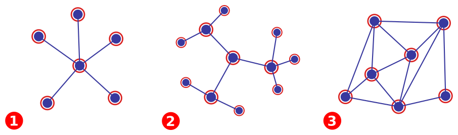
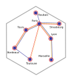
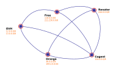
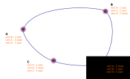
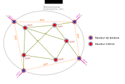

## Topologie centralisée, décentralisée, acentrée

 1. **Reseau centralisé** : les routes ne convergent que vers un point central,
    il ne sont pas connectés entre eux. Si le centre venait à tomber, alors le
    réseau cesserait de fonctionner.
 2. **Réseau décentralisé** : Notre topologie est toujours basée sur un centre,
    mais les nœuds de second niveaux servent de point de connexion aux points de
    troisième niveau et ainsi de suite. En cas de panne sur le centres, les
    branches continueraient ainsi de fonctionner mais de façon isolé.
 3. **réseau acentré** : il n'y a plus du tout de centre, seulement des nœuds
    interconnectés, en vas de panne de l'un d'eux, seul le réseau qu'il gère
    sera inaccessible.

Internet est conçu pour être un réseau acentré, et en règle générale les
protocole réseaux (ssh, http, smtp, et.) sont conçu pour fonctionner de cette
manière : ils n'ont pas besoin d'une quelconque autorité pour fonctionner.
Cependant certains services comme le *DNS* fonctionne en mode décentralisé : les
serveurs racines sont au centre de son fonctionnement. C'est d'ailleurs
considéré comme le point faible d'Internet.

## Architecture d'Internet d'un point de vue physique

Dans le cas d'une connexion Internet domestique, le routage est simple et
contient seulement deux entrées : 

 * une route **par défaut** : la passerelle
 * une route **pour le réseau local**.

Un réseau d'entreprise est en général plus complexe, l'on peut prendre l'exemple
du CREMI : la table de routage prend en compte les différentes salles plus une
route vers REAUMUR

### POP, interconnexion

Chaque opérateur possède des POP *Point Of Presence* dans des grandes villes
française, à Bordeaux par exemple nous avons le Netcenter SFR et le Datacenter
Cogent.

Le schéma ci-dessus, s'il ne représente pas la réalité montre ce qui pourrait
être des POP dans les grandes villes françaises et les différents backbones
(chaque couleur de trait représente un opérateur).

Lorsque deux opérateurs sont présents dans une même ville, il peuvent
s'interconnecter en créant des **liens de peering**.

Le schema se veux représentatif du fonctionnement d'Internet en France :
nous sommes en présence d'une maillage à forte tendance centralisée : à lui tout
seul, le datacenter TH2 Paris voit passer 50 à 70% du trafic. Certaines
initiative comme Lyonix à Lyon ou Tounix à Toulouse visent à changer la donne.

## Architecture d'Internet d'un point de vue réseau

Schéma représentant des **Autonomous system** d'opérateurs et les liens de
peering. Les liens sont négociés entres opérateurs au niveau dimension du lien
et tarif.

## Autonomous system

Un système autonome est un ensemble de réseaux informatiques intégré à Internet
dont la politique de routage interne est cohérente. Chaque AS est identifié par
un identifiant sur 32 bits et défini par le RIR (le RIPE-NCC en Europe).

## Routage Dynamique

### Routing Information Protocol - RIP

C'est un protocole de routage IP distribué : chaque machine du réseau échange
avec ses voisins leurs réseau respectif et leurs métriques (nombres de saut
nécessaires pour accéder à un réseau donné)

RIP ne prend pas en compte la bande passante : il préfèrera passer par un saut
sur un lien à 56k que deux sur des liens gigabit.

[Voir RIP][l_ripw] sur Wikipédia

[l_ripw]:https://fr.wikipedia.org/wiki/Routing_Information_Protocol

### Open Shortest Path First 

OSPF est un protocole de routage Interne (d'un AS) créé pour remplacer RIP par
l'IETF en 1987. Chaque routeur établit une relation d'adjacence avec ses voisins
immédiats en envoyant des messages `hello`. Chaque routeur communiqu alors
la liste des réseaux auxquels il est connecté par des messages `Link-State
advertisement` (LSA).

C'est un protocole gourmand en mémoire utilisé uniquement à l'intérieur d'une
structure.

[Voir OSPF][l_ospfw] sur Wikipédia

[l_ospfw]:https://fr.wikipedia.org/wiki/Open_Shortest_Path_First 

### Border Gateway Protocol

Comme son nom l'indique, BGP est utilisé sur les routeurs de bordure des
opérateurs (sur les liens de peering). Son fonctionnement est similaire à RIP
mais il annonce les préfixes et le chemin (*ASPATH*) par exemple : 

> OVH annonce à RENATER qu'il faut passer par lui pour accéder à 12.0.0.0/8.
> RENATER annonce alors qu'il est possible de passer par lui pour accéder à ce
> réseau et ainsi de suite.

BGP représente actuellement environ 100 changements par minutes et 5 minutes de
propagation dans le monde.

### Schéma global

Les routeurs de bordure utilisent iBGP à l'intérieur de l'AS alors qu'eBGP est
utilisé à l'extérieur, sur des connexion point à point.

Les routeurs de bordure peuvent annoncer une partie des réseaux internes afin
d'optimiser les routes. Il n'est cependant pas conseillé d'annoncer des réseaux
plus petit qu'un `/24`

[Voir BGP][l_bgpw] sur Wikipédia

[l_bgpw]:https://fr.wikipedia.org/wiki/Border_Gateway_Protocol

