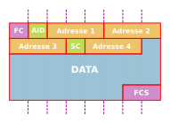

Le Wifi est un ensemble de **protocoles de communication sans fils** issus de la
norme 802.11. Il correspond aux couches 1 et 2 (physique et liaison) du modèle
OSI. Son fonctionnement se veut similaire  au protocole Ethernet.  Au niveau
physique, les communications se basent sur les ondes électromagnétiques sur
2,4Ghz ou 5Ghz.

On distinguera plusieurs mode de fonctionnement : 

 - **infrastructure** :  nous avons un ou plusieurs points d'accès faisant
     office de switch et des clients.
 - **ad hoc** : plusieurs clients se connectent entre eux pour, par exemple
     échanger des fichiers ou partager des ressources (imprimantes ...)
 - **pont** : deux points d'accès inter-connectés pour étendre un réseau filaire
 - **répéteur** : deux ou plusieurs points d'accès sont inter-connectés pour
     étendre la portée du réseau. Dans ce mode les connexion Ethernet des
     points d'accès restent inactifs (sauf sur le premier AP)

De par la nature du média, une carte d'accès à un réseau wifi écoute toutes les
communications dans sa zone d'action et ce sans être présente sur les réseaux
disponibles. Mais le système d'exploitation cache tous les paquets qui ne sont
pas destinés explicitement à notre machine.

Il est cependant possible de passe la carte en mode *promiscuous* afin d'obtenir
l'ensemble des trames disponible.

## Les points d'accès

Un points d'accès rend disponible un réseau wifi. Voici les éléments qui
définissent un réseau wifi basé sur un point d'accès.

 - Le **BSSID** : l'adresse MAC du point d'accès
 - Le **BSS** : pour *Basis Service Set* représente le points d'accès et ses 
     clients
 - Le **ESS**: pour *Extended Service Set* est un ensemble de BSS cohérents 
     regroupés sous un même ESSID, par exemple le réseau wifi *eduroam*
 - Le **ESSID** : abrégé SSID pour *Extended Service Set IDentifier*
 
Lorsque un point d'accès est en fonctionnement, il envoie à intervalle régulier
une trame *beacon* pour annoncer sa présence. Ces trames donnent son BSSID, ses 
caractéristiques et éventuellement son *ESSID*.

### analyse d'une trame Wifi

Voici le schéma de fonctionnement d'une trame Wifi 

Voici le détail : 

 - **Frame Control** : donne des informations sur le type de trame, ce segment
     est divisé en plusieurs sous champs. Il y a trois type de trame :
      - *Gestion* : utilisées pour les associations, désassociations,
          authentifications etc.
      - *Contrôle* : pour ce qui touche aux contrôles des transmissions comme
          les *ACK*
      - * *Data* : pour la transmission de données
 - **AID / duration** : en  fonction du type de trame, ce champs
     peut avoir des fonction différentes
 - **Adresses 1,2,3,4** : dans le cas d'un réseau Wifi, deux adresses ne
     suffisent pas pour déterminer le chemin d'une trame. Il est donc possible
     de stocker jusqu'à 4 adresses de type MAC (6 octets) Voici les 4 adresses
     possibles : 
     - *SA* : adresse source, ce peut être une adresse sur un réseau filaire ou
         d'un AP wifi.
     - *DA* : adresse de destination peut être sur un réseau sans fil ou filaire
     - *TA* : adresse de la station ayant mis la trame sur le réseau wifi
     - *RA* : adresse du périphérique wifi ayant reçu la trame sur le réseau
         wifi
 - **Sequence Control** : numéro de séquence dans le cas de trames fragmentées.
 - **FCS** : somme de contrôle de la trame sur 32 bits
